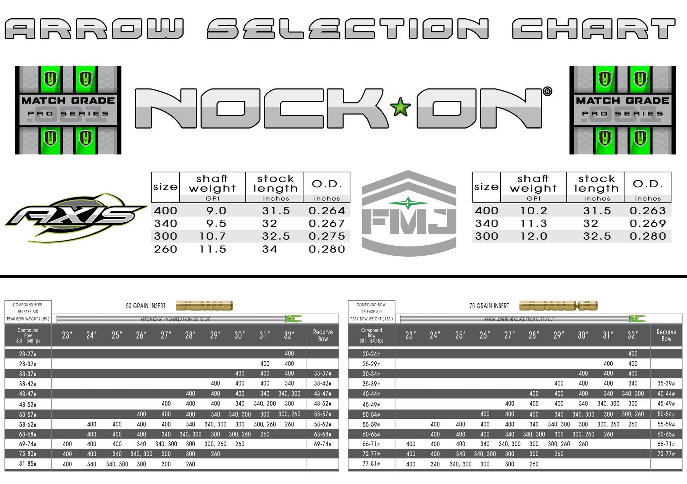

# Easton Nock On Arrow Spine Calculator 

---
A simplified version of the first script I ever wrote. This calculator takes in your grain insert, draw length, and bow poundage and then tells you which arrow spine you should use according to the spine chart below.

---

